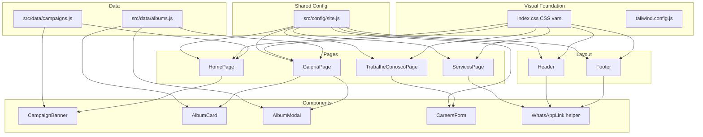

# Site Experience Refactor Design

**Spec**: `.specs/features/site-experience-refactor/spec.md`
**Status**: Draft

---

## Architecture Overview

This refactor touches the visual foundation (CSS variables, Tailwind config), navigation (Header, Footer, routes), three page rewrites (HomePage, GaleriaPage, new TrabalheConoscoPage), one page edit (ServicosPage), and four new/rewritten components (CampaignBanner, AlbumCard, AlbumModal, CareersForm). A shared constants file centralizes all site configuration.



---

## Code Reuse Analysis

### Existing Components to Leverage

| Component | Location | How to Use |
| --- | --- | --- |
| `Carousel` (shadcn/ui, embla-based) | `src/components/ui/carousel.jsx` | Use inside `AlbumModal` for media navigation. Already supports prev/next, keyboard arrows, and loop via embla opts. |
| `Dialog` (Radix) | `src/components/ui/dialog.jsx` | Reuse as the modal shell for `AlbumModal`, replacing `PortfolioModal`. |
| `Button` | `src/components/ui/button.jsx` | All CTAs, filters, form submit. |
| `Input`, `Label`, `Textarea` | `src/components/ui/{input,label,textarea}.jsx` | Careers form fields. |
| `Select` | `src/components/ui/select.jsx` | Existing pattern from `ContactForm` for dropdowns. |
| `Sheet` | `src/components/ui/sheet.jsx` | Mobile nav in Header (already used). |
| `toast` (sonner) | `src/components/ui/sonner.jsx` | Success/error notifications for careers form. |
| `motion` (framer-motion) | External dep | Animations in all pages, already used everywhere. |
| `Helmet` | External dep | SEO per page, already used on all pages. |

### Integration Points

| System | Integration Method |
| --- | --- |
| n8n webhook | `fetch()` POST with `multipart/form-data` from `CareersForm`. URL from `site.js` constant. |
| Google Drive video | `AlbumModal` constructs `https://drive.google.com/file/d/{id}/preview` iframe from stored file ID. |
| WhatsApp | `WhatsAppLink` helper builds `https://wa.me/5584921768017?text={encodedMessage}`. |
| Google Drive images | Existing `lh3.googleusercontent.com` URL pattern preserved for album media. |

---

## Components

### `src/config/site.js` (new)

- **Purpose**: Single source of truth for site-wide configuration constants.
- **Location**: `src/config/site.js`
- **Exports**:
  - `WHATSAPP_NUMBER` — `"5584921768017"`
  - `WHATSAPP_URL(message)` — builds full `wa.me` URL with encoded message
  - `INSTAGRAM_URL` — `"https://www.instagram.com/moisesnunescv/"`
  - `LOGO_URL` — `"https://lh3.googleusercontent.com/d/18xOXZzf3FW_ptUF9UNNSdTxL6ec5QnfY=w1000?authuser=0"`
  - `N8N_WEBHOOK_URL` — `"https://n8n.devsr.com.br/webhook/moisesNunesAnalise"`
  - `SHOW_CAMPAIGN_BANNER` — `true` (boolean toggle)
  - `CAMPAIGN_SVG_URL` — `"https://lh3.googleusercontent.com/d/1UePH9sYu6RP88jlK6XFMjurKBIBbVqDs=w1000?authuser=0"`
  - `RESUME_MAX_SIZE_MB` — `10`
  - `RESUME_ALLOWED_TYPES` — `['application/pdf', 'application/msword', 'application/vnd.openxmlformats-officedocument.wordprocessingml.document']`
- **Dependencies**: None
- **Reuses**: Replaces hardcoded values in Header, Footer, HomePage, ServicosPage, ContatoPage.

### `src/data/albums.js` (new)

- **Purpose**: Structured album data replacing the flat `projects` array in `GaleriaPage`.
- **Location**: `src/data/albums.js`
- **Exports**: `albums` array, `categories` array
- **Data model**: See Data Models below.
- **Dependencies**: None
- **Reuses**: Existing 76 project entries from `GaleriaPage.jsx:49-582`, regrouped into albums by category and title similarity.

### `src/data/campaigns.js` (new)

- **Purpose**: Replaceable campaign card data for the home page.
- **Location**: `src/data/campaigns.js`
- **Exports**: `campaigns` array of `{ id, title, description, image, ctaText, ctaLink }`
- **Dependencies**: None
- **Reuses**: New data, follows the same Google Drive image URL pattern.

### `CampaignBanner` (new)

- **Purpose**: Full-width SVG strip rendered below the hero, controlled by `SHOW_CAMPAIGN_BANNER`.
- **Location**: `src/components/CampaignBanner.jsx`
- **Interfaces**:
  - Props: none (reads from `site.js`)
  - Renders: `` with `CAMPAIGN_SVG_URL` in a full-width `<section>` when `SHOW_CAMPAIGN_BANNER` is `true`; renders `null` otherwise.
- **Dependencies**: `site.js` constants
- **Reuses**: Standard `` element with `onError` fallback to alt text.

### `CampaignCards` (new)

- **Purpose**: Grid of replaceable campaign cards below the banner.
- **Location**: `src/components/CampaignCards.jsx`
- **Interfaces**:
  - Props: none (reads from `campaigns.js`)
  - Renders: responsive grid of cards with image, title, description, and optional CTA link.
- **Dependencies**: `campaigns.js`, `Button`, `Link`
- **Reuses**: framer-motion animation pattern from `ServiceCard`.

### `AlbumCard` (replaces `PortfolioCard`)

- **Purpose**: Gallery grid card showing album cover, title, and category badge.
- **Location**: `src/components/AlbumCard.jsx`
- **Interfaces**:
  - Props: `{ album, onClick, delay }`
  - Renders: card with `object-contain` image (no crop), compact caption below.
- **Dependencies**: framer-motion
- **Reuses**: Visual structure from `PortfolioCard` but swaps `object-cover` → `object-contain` and moves caption below image instead of hover overlay.

### `AlbumModal` (replaces `PortfolioModal`)

- **Purpose**: Modal dialog with embla carousel showing all media items in an album.
- **Location**: `src/components/AlbumModal.jsx`
- **Interfaces**:
  - Props: `{ isOpen, onClose, album }`
  - Internal state: `currentIndex` (number)
  - Renders: `Dialog` with `Carousel` containing `CarouselItem` per media entry. Each item renders either `` (type `image`) or `<iframe>` (type `google-drive-video`). Prev/next buttons from shadcn Carousel. Loop enabled via embla `loop: true` opt. Compact caption with item index indicator.
- **Dependencies**: `Dialog`, `Carousel` + sub-components, framer-motion
- **Reuses**: shadcn `Carousel` (embla-based) from `src/components/ui/carousel.jsx`, `Dialog` from `src/components/ui/dialog.jsx`.

### `WhatsAppLink` / `WhatsAppButton` (new helper)

- **Purpose**: Reusable helper that builds WhatsApp deep links with contextual messages.
- **Location**: `src/components/WhatsAppLink.jsx`
- **Interfaces**:
  - `WhatsAppLink({ message, children, className })` — renders `<a>` with `href={WHATSAPP_URL(message)}` and `target="_blank"`.
  - `WhatsAppButton({ message, children, variant, size, className })` — renders `<Button asChild>` wrapping the link.
- **Dependencies**: `site.js`, `Button`
- **Reuses**: Button `asChild` pattern from existing Header CTA.

### `CareersForm` (new)

- **Purpose**: Job application form with file upload, validated client-side, submitted to n8n webhook.
- **Location**: `src/components/CareersForm.jsx`
- **Interfaces**:
  - Uses `react-hook-form` for validation (same pattern as `ContactForm`).
  - Fields: `name` (required), `email` (required + regex), `phone` (required), `message` (required), `resume` (required, file input with type/size validation).
  - `onSubmit`: builds `FormData`, appends all fields + file, calls `fetch(N8N_WEBHOOK_URL, { method: 'POST', body: formData })`.
  - States: idle, submitting, success (toast + reset), error (toast + preserve fields).
  - Prevents concurrent submission via `isSubmitting` guard.
- **Dependencies**: `react-hook-form`, `site.js`, `toast`, `Input`, `Label`, `Textarea`, `Button`
- **Reuses**: Form validation pattern from `ContactForm.jsx:1-142`.

### `Header` (modified)

- **Purpose**: Update logo, add WhatsApp CTA, add "Trabalhe Conosco" nav link.
- **Changes**:
  - Logo `src` → `LOGO_URL` from `site.js`.
  - Add `{ path: '/trabalhe-conosco', label: 'Trabalhe Conosco' }` to `navLinks`.
  - Replace "Solicitar orçamento" CTA with `WhatsAppButton` using message "Olá! Gostaria de solicitar um orçamento para comunicação visual."
  - Update colors to match new palette (text colors, backgrounds).
- **Reuses**: Existing structure, Sheet for mobile.

### `Footer` (modified)

- **Purpose**: Update logo, remove Facebook/LinkedIn, update Instagram URL, add WhatsApp link, add "Trabalhe Conosco" link.
- **Changes**:
  - Logo `src` → `LOGO_URL` from `site.js`.
  - Remove `Facebook` and `Linkedin` imports and buttons.
  - Update Instagram `href` → `INSTAGRAM_URL`.
  - Add WhatsApp link with `Phone`/`MessageCircle` icon.
  - Add "Trabalhe Conosco" to quick links nav.
  - Update background/border colors to new palette.

### `HomePage` (modified)

- **Purpose**: Remove services grid, add campaign banner + cards, update hero colors, add WhatsApp CTA.
- **Changes**:
  - Remove `services` array (lines 11-89) and `ServiceCard` import.
  - Remove entire "Services Section" (lines 148-179).
  - Insert `<CampaignBanner />` directly after hero `</section>`.
  - Insert `<CampaignCards />` section after banner.
  - Update hero background to `#01154A` via CSS var.
  - Replace "Solicitar orçamento" button with `WhatsAppButton`.
  - Update CTA section colors.

### `ServicosPage` (modified)

- **Purpose**: Add "Veja mais" button per service linking to filtered gallery.
- **Changes**:
  - Add a second `Button` per service: `<Link to={`/galeria?categoria=${service.id}`}>Veja mais</Link>`.
  - Replace "Solicitar orçamento" CTA with `WhatsAppButton` with service-specific message.
  - Update all color references from `--navy` to new palette vars.

### `GaleriaPage` (rewritten)

- **Purpose**: Consume album data, support URL query param for category filter, render `AlbumCard` grid, open `AlbumModal`.
- **Changes**:
  - Import `albums` and `categories` from `src/data/albums.js`.
  - Read `categoria` from `useSearchParams()` (react-router-dom) to set initial `selectedCategory`.
  - Filter albums by category.
  - Render `AlbumCard` per album, `AlbumModal` on selection.
  - Update hero, filter, and CTA section colors to new palette.
  - Remove inline `projects` array (moved to `albums.js`).

### `TrabalheConoscoPage` (new)

- **Purpose**: Careers page with hero, company culture intro, and `CareersForm`.
- **Location**: `src/pages/TrabalheConoscoPage.jsx`
- **Structure**: Helmet → Header → Hero section → Form section (two-column: info + form) → Footer.
- **Dependencies**: `Header`, `Footer`, `CareersForm`, `Helmet`, `motion`, `Button`.
- **Reuses**: Page layout pattern from `ContatoPage.jsx`.

### `App.jsx` (modified)

- **Purpose**: Add route for `/trabalhe-conosco`.
- **Changes**: Import `TrabalheConoscoPage`, add `<Route path="/trabalhe-conosco" element={<TrabalheConoscoPage />} />`.

### `index.css` (modified)

- **Purpose**: Apply new Moisés palette.
- **Changes**:
  - `--background`: change to `224 97% 15%` (#01154A)
  - `--foreground`: change to `192 85% 92%` (#DAF5FC) — subtitle color becomes default text
  - `--card`: adjust for contrast on dark bg (e.g., `224 80% 20%`)
  - `--card-foreground`: `0 0% 100%` (white)
  - `--popover` / `--popover-foreground`: match card
  - `--border` / `--input`: `224 50% 30%` (subtle blue border)
  - `--radius`: `0.7rem`
  - `--primary`: keep or adjust for accent on dark bg
  - `--navy`: becomes the background, so `--navy` = `224 97% 15%`
  - `--navy-foreground`: `0 0% 100%`
  - Heading color: `h1`–`h6` → `0 0% 100%` (white)
  - Body text: `192 85% 92%` (#DAF5FC)
  - Focus ring: ensure visible contrast on dark bg (e.g., `--ring: 192 85% 92%`)
  - Remove dark mode override (site is now inherently dark-themed)

### `tailwind.config.js` (modified)

- **Purpose**: Ensure `borderRadius` uses new `--radius` value (already does via `var(--radius)`).
- **Changes**: No structural change needed — `--radius` change in CSS propagates. Verify `lg`, `md`, `sm` calculations still work with `0.7rem`.

---

## Data Models

### Album

```typescript
interface Album {
  id: string;              // unique album identifier, e.g. "finecap-2024"
  category: string;        // category id matching services, e.g. "finecap"
  title: string;           // display title
  description: string;     // short description
  cover: string;           // cover image URL
  media: AlbumMedia[];     // ordered list of media items
}

interface AlbumMedia {
  subId: string;           // unique within album, e.g. "finecap-2024-1"
  type: 'image' | 'google-drive-video';
  url?: string;            // image URL (when type = 'image')
  driveFileId?: string;    // Google Drive file ID (when type = 'google-drive-video')
  alt?: string;            // accessibility text
  caption?: string;        // optional per-item caption
}
```

**Relationships**: Each album belongs to one category. Categories match service IDs from `ServicosPage` so "Veja mais" deep-links work.

### Campaign

```typescript
interface Campaign {
  id: string;
  title: string;
  description: string;
  image: string;           // card image URL
  ctaText?: string;        // optional CTA label
  ctaLink?: string;        // optional CTA destination (internal or external)
}
```

### Category

```typescript
interface Category {
  id: string;              // e.g. "led", "finecap", "all"
  label: string;           // display label
}
```

---

## Album Grouping Strategy

The existing 76 flat projects will be grouped into albums by category + title similarity:

| Category | Albums | Source IDs |
| --- | --- | --- |
| `finecap` | 1 album "Finecap 2024" | IDs 10, 11, 26-34 |
| `natal_na_serra` | 1 album "Natal na Serra" | IDs 35-44 |
| `sj_riacho` | 1 album "São João - Riacho de Santana" | IDs 45-59 |
| `led` | 1-2 albums | IDs 1, 4 |
| `impressao` | 1 album | IDs 2, 5, 9, 71-76 |
| `laser` | 1 album | IDs 3, 6 |
| `fardamentos` | 1 album | IDs 7, 17, 18, 68-70 |
| `brinde` | 1-2 albums (agendas, canecas, etc.) | IDs 8, 12, 60-67 |
| `toldo` | 1 album | IDs 13, 14 |
| `frota` | 1 album | IDs 15, 16 |
| `grafica_rapida` | 1 album | IDs 19, 20, 21 |
| `adesivacao` | 1 album | IDs 22, 23 |
| `fachada` | 1 album | IDs 24, 25 |

Each album's `media` array preserves the original image URLs. A placeholder `google-drive-video` entry will be included in one album (e.g., `finecap`) using the provided Drive ID `1MQchokMrnCJDhla1fOWiZeRVDS0Xneoo` to demonstrate the video structure.

---

## Error Handling Strategy

| Error Scenario | Handling | User Impact |
| --- | --- | --- |
| Logo image fails to load | `` swaps to text "Moisés Nunes CV" | Brand text visible, layout stable |
| Campaign SVG fails to load | `` hides the banner section | No broken image icon, layout collapses |
| n8n webhook returns non-2xx | Toast error "Não foi possível enviar. Tente novamente." Form fields preserved. | Candidate can retry without re-entering data |
| n8n webhook network timeout | Same as above, 30s `AbortController` timeout | Same |
| Resume file too large | Client-side validation before submit, error message below field | Upload prevented, clear constraint message |
| Resume wrong type | Client-side validation, error message | Upload prevented, accepted types listed |
| Google Drive video iframe fails | Fallback link to `https://drive.google.com/file/d/{id}/view` below iframe | User can open video in new tab |
| Gallery category with no albums | Empty state message "Nenhum projeto encontrado nesta categoria." | No empty grid |

---

## Risks & Concerns

| Concern | Location (file:line) | Impact | Mitigation |
| --- | --- | --- | --- |
| Hardcoded logo URL in two places | `Header.jsx:30`, `Footer.jsx:14` | Changing logo requires two edits, easy to miss one | Centralize in `site.js` `LOGO_URL` |
| 76 inline project objects in component | `GaleriaPage.jsx:49-582` | Large component, hard to maintain, slow to edit | Extract to `src/data/albums.js` |
| Contact form simulates submission | `ContactForm.jsx:18-24` | No real delivery for quote form | Out of scope per spec; only careers form gets n8n integration |
| No `useSearchParams` usage currently | `GaleriaPage.jsx:12` | Gallery can't receive deep-link filter | Add `useSearchParams` from react-router-dom v7 |
| Dark theme removes need for `.dark` class | `index.css:53-78` | Dark mode overrides become dead code | Remove `.dark` block; site is inherently dark |
| `object-cover` crops images | `PortfolioCard.jsx:17`, `PortfolioModal.jsx:23` | Images lose content | Switch to `object-contain` in `AlbumCard` and `AlbumModal` |
| embla Carousel `loop` opt | `carousel.jsx:33` | Default embla doesn't loop | Pass `opts={{ loop: true }}` to `Carousel` in `AlbumModal` |
| n8n webhook CORS | External (n8n server) | Browser may block cross-origin POST | n8n webhook must have CORS enabled; verify during implementation |
| File upload size in multipart | `CareersForm.jsx` (new) | Large files may timeout | 10MB limit enforced client-side; n8n has its own payload limits |

---

## Tech Decisions

| Decision | Choice | Rationale |
| --- | --- | --- |
| CSS variable approach for palette | HSL values in `:root`, same pattern as current | Minimizes change surface; Tailwind already reads `hsl(var(--x))` |
| Carousel library | Existing shadcn `Carousel` (embla-carousel-react) | Already installed, no new dependency, supports loop and keyboard nav |
| Album data location | `src/data/albums.js` | Separates data from view logic, makes editing content simpler for non-devs |
| Site config location | `src/config/site.js` | Single file for all easy-to-change constants (webhook URL, WhatsApp, logo, banner toggle) |
| Gallery deep-linking | `useSearchParams` from react-router-dom v7 | Already a dependency; standard SPA approach |
| Careers form submission | `fetch` + `FormData` (multipart) | Native browser API, no extra dependency, n8n accepts multipart |
| Video embedding | Google Drive preview iframe | Stakeholder-provided format; only needs file ID |
| Remove dark mode | Delete `.dark` CSS block | Site is now inherently dark-themed; dual mode adds complexity with no value |

> **Project-level decisions:** None — all decisions are feature-local. No `AD-NNN` entries needed.
